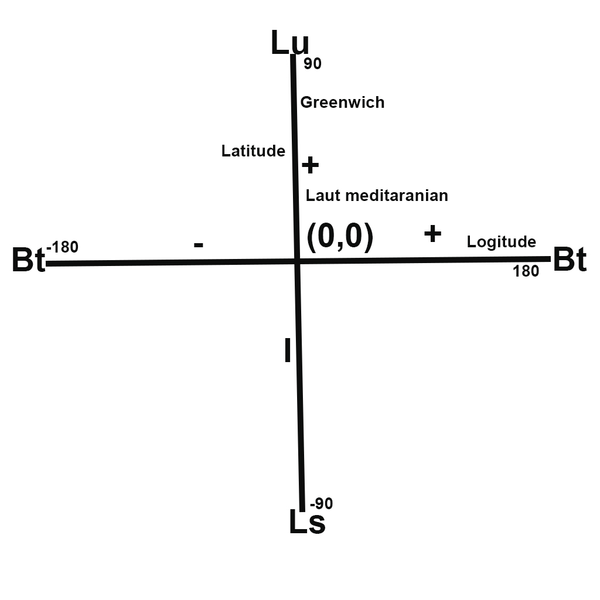

**GEOGRAPHICAL INFORMATION SYSTEM**

  

**Latar Belakang Masalah**

1. Apakah yang dimaksud dengan Geo?
2. Apakah yang dimaksud Graphical?
3. Apakah yang dimaksud Information?
4. Apakah yang dimaksud System?
5. Apakah yang dimaksud dengan Geospasial?
6. Apakah yang dimaksud dengan Titik Koordinat?

**Tujuan**

1. Geo adalah bahasa Yunani yang artinya bumi
2. Graphical bisa diartikan sebagai penggambaran
3. Information adalah hasil pengolahan data
4. System adalah sebuah alur
5. Geospasial adalah data yang berkaitan dengan ukuran dimensi dan ruang
6. Titik Koordinat adalah petunjuk antara garis lintang dan garis bujur atau biasa disebut garis vertical dan garis horizontal dan terakhir Latitude dan Longitude

jadi kesimpulan Geographical Information System adalah alur dari hasil pengelohan data pada penggambaran bumi atau permukaan bumi

pada Geographical information system menggunakan aplikasi QGIS

- untuk lebih dalam lagi Geospasial akan dibahas gambar dibawah ini

  

pada gambar diatas menunjukkan bahwa terdapat sebuah ruang(x,y,z)

- sedangkan Titik Koordinat akan dibahas pada gambar dibawah ini

  

pada gambar diatas menjelaskan bahwa titik koordinat  berada pada Negara Inggris tepatnya didaerah Greenwetch karena didaerah tersebut nol derajat dan lokasi perputaran bumi selanjutnya pada lintang utara pada prime meridian dan biasa disebut garis bujur pada titik koordinat geografis.

** Penutup**

**Kesimpulan**

Pada pertama ini ditarik kesimpulan bahwa kita dapat mengetahui tentang Sistem Informasi Geogerafis beserta dengan Geospasial dan Titik Koordinat

**Saran**

Saran untuk pertemuan pertama adalah materi sudah cukup dipahami namun mahasiswa khususnya Teknik Informatika pasti membutuhkan yang namanya praktek sehingga kuliah berjalan dengan baik dan lancar dan amin.

* Nama : Suriadi Zainuddin
* NPM : 1144092
* Kelas : 3C
* Prodi : D4 Teknik Informatika
* Mata Kuliah : Sistem Informasi Geografis

Link Github : https://github.com/Suriadizainuddin/GIS

Scan Plagiarisme

1. Link https://drive.google.com/open?id=0B4xKZBSfbWnFY2NuWkJYcFlJeUk
2. Link https://drive.google.com/open?id=0B4xKZBSfbWnFdXFqYlRPQUZzTUU
