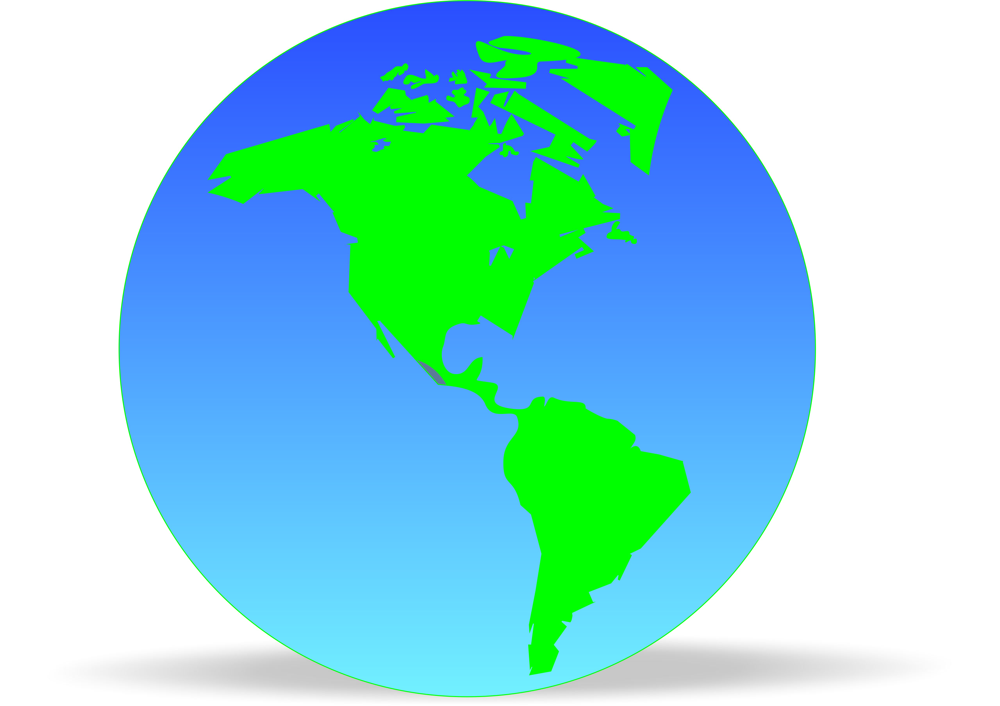
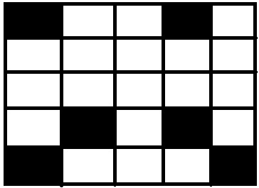
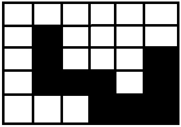
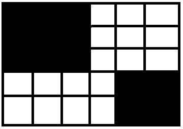

GEOSPASIAL

 

  

Geospasial adalah keruangan yang menunjukkan lokasi,wilayah,letak dan posisi suatu objek yang berada dibawah atau diatas permukaan bumi yang dinyatakan pada system titik koordinat tertentu.

Data Vector adalah data yang menampilkan keruangan atau pola,titik kurva atsu polygon. Data vector ini sangan baik untuk mempersentsikan gambar jalan, rel kereta api karena data vector ini sangat cocok untuk digunakan untuk keperluan administrasi peta dan cocok untuk pembangunan jalan contoh gambarnya seperti dibawah.

  

 

Data Raster adalah data yang diambil atau data yang dikumpulkan dari data  radar setelit atau citra perekaman foto sehingga data raster nanntinya akan  berupa gambaran permukaan bumi dalam bentuk warna hijau,kuning ,biru dan lainnya,  contoh gambarnya seperti dibawah.

  

 

  

  

  
Penutup

Kesimpulan

Dari penjelasan diatas dapat disimpulkan bahwa Geospasial adalah menunjukkan lokasi atau tata letak sebuah wilayah sedangkan vector dan raster dapat disimpulkan bahwa masing-masing menampilkan data yang berbeda

Saran

Saran saya adalah pelajaran geospasial ini lebih diperdalam lagi karena pelajaran ini sangat berperan penting dalam jurusan kami yakni Teknik InformatikaS