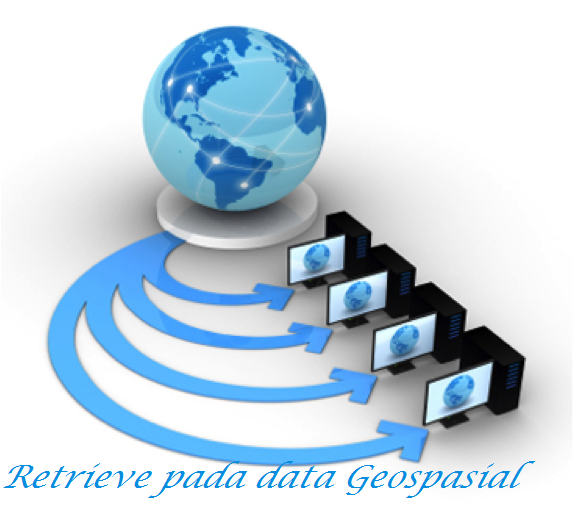

RETRIEVE PADA DATA GEOSPASIAL

  

 
Latar Belakang Masalah

Geospasial adalah keruangan yang menunjukkan lokasi,wilayah,letak dan posisi suatu objek yang berada dibawah atau diatas permukaan bumi yang dinyatakan pada system titik koordinat tertentu. Namun disini saya akan membahas cara memanipulasi data geospasial seperti halnya pada framework lain pada data vector berformat shp.

1. Apakah yang di maksud dengan Retrieve
2. File apa saja kah yang dibutuhkan untuk melakukan manipulasi
3. Apa perbedaan shp dan dbf

Penjelasan :

1. Retrieve merupakan bagian dari memanipulasi data yang digunakan untuk melihat isi data pada geospasial yaitu berbentuk shape file.  Dan suatu cara untuk melakukan select/view, data record dari file dbf dan geometri dari file shp.
2. File yang dibutuhkan dalam memanipulasi

1. Shp = berupa koordinat
2. Dbf = berupa table
3. Shx = berisi index data

1. Shp adalah salah satu file yang berada didalam shapefile yang menyimpan data geometri

- Membaca data shp

&gt;&gt; import shapefile

&gt;&gt; sf = shapefile.Reader(&quot;namafile.shp&quot;)

&gt;&gt; sf.shapes()

&gt;&gt; a = sf.shapes()

&gt;&gt; len(a)

**Dbf**  adalah sebuah file yang menyimpan file tabular yang menyimpan data attribute

- Membaca data DBF

       &gt;&gt; import shapefile

       &gt;&gt; sf.records()

&gt;&gt; sf.records(n)

**Penutup**

Kesimpulan

Dari penjelasan diatas dapat disimpulkan bahwa Retrieve pada data geospasial  merupakan bagian dari memanipulasi data yang digunakan untuk melihat isi data pada geospasial dan menghitung jumlah record.

Saran

Untuk pembahasan mengenai Retrieve lebih diperdalam lagi dan dipraktikkan secara langsung agar mudah di mengerti dan di pahami.