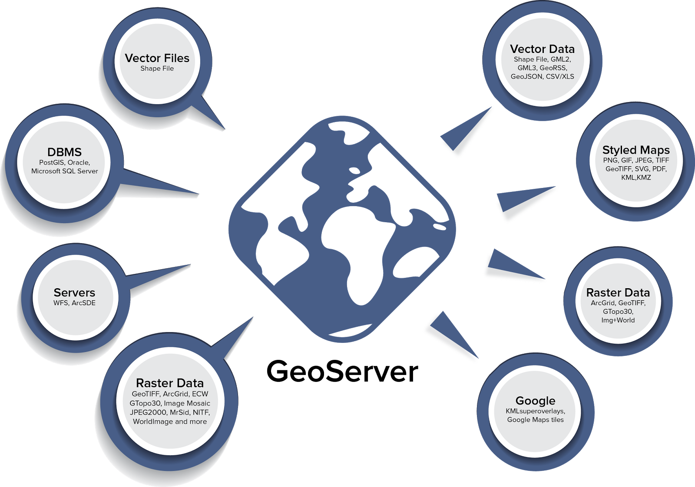

**&quot;Web Service Geospasal &amp; Open Geospatial Consortium&quot;**

  

1. Jelaskan yang di maksud Geospasial Web Services
2. Jelaska yang di maksud WEB MAP SERVICE (WMS)
3. Jelaskan yang di maksud Web Coverage Processing Service (WCPS)
4. Jelaskan yang di maksud Web Features Services (WFS)
5. Jelaskan yang di maksud Web Features Service Transcational (WFS-T)
6. Jelaskan yang di maksud Web Processing Service (WPS)
7. Jelaskan yang di maksud Open GIS Location Service (OpenLS)

Pembahasan

1. Web Service geospasial (GWS) membantu pengguna menemukan, akses, dan kadang-kadang memanipulasi data yang menarik di web dinamis dari jaringan terdistribusi. GWS dirancang untuk mengumpulkan data sekali dan memperbarui atau mengeditnya secara real time. Banyak pengguna GIS tidak mengikuti pengembangan alat dan standar yang memfasilitasi penciptaan dinamis GWS untuk mengakses data geospasial dan produk. Namun non-ahli sudah penggelaran GWS dibangun untuk SUN (Fischer 2009).
2. Web Map Service adalah layanan basis data spasial yang beroperasi secara online. WMS menghasilkan peta yang bergeoreferensi. Pengertian Peta dalam hal ini adalah representasi visual dari geodata, dan bukan data geospasial itu sendiri. WMS meproduksi data yang bereferensi geografis secara dinamis dari informasi basis data geospasial. Peta itu sendiri merupakan informasi geografis yang digambarkan secara dijital oleh komputer untuk keperluan penyajian data spasial. Peta hasil WMS biasanya berupa gambar dengan format PNG, GIS atau JPEG. dan dapat ditampilkan pada _browser_. Standar WMS juga mendukung kemampuan untuk mendefinisikan apakah gambar yang dihasilkan harus transparan atau tidak, sehingga dapat melakukan tumpang tindih beberapa tema atau layer. Spesifikasi WMS dikeluarkan oleh OGC

3. Web Coverage Processing Service (WCPS) adalah bahasa untuk penyaringan dan pengolahan coverage raster multi-dimensi, seperti sensor, simulasi, gambar, dan data statistik. Web Cakupan Layanan Pengolahan dikelola oleh Konsorsium Geospasial Terbuka (OGC). bahasa query raster ini memungkinkan klien untuk mendapatkan data cakupan asli, atau informasi yang diperoleh, secara platform netral melalui Web.
4. Web Features Services (WFS) menyediakan antarmuka yang memungkinkan permintaan untuk fitur geografis di seluruh web menggunakan panggilan platform-independen. Seseorang dapat berpikir tentang fitur geografis sebagai &quot;kode sumber&quot; di belakang peta, sedangkan antarmuka WMS atau online pemetaan portal keramik seperti Google Maps kembali hanya gambar, yang akhir-pengguna tidak dapat mengedit atau spasial menganalisis.
5. Web Features Service Transcational adalah Interface WFS-T mengizinkan pengguna untuk membuat (insert), menghapus, memperbarui dan mengunci contoh fitur, dan mengambil atau fitur query. Interface yang ditulis dalam XML, sementara GML digunakan untuk menggambarkan fitur dalam antarmuka. Sehingga transaksi dapat disimpan dengan benar dalam datastore (misalnya, SQL RDBMS), semantik transaksi diterapkan.
6. Web Service Processing (WPS) merupakan antarmuka Standar memberikan aturan untuk standardisasi bagaimana input dan output (permintaan dan tanggapan) untuk memohon layanan pemrosesan geospasial, seperti poligon overlay, sebagai layanan web. WPS standar mendefinisikan bagaimana klien dapat meminta eksekusi sebuah proses, dan bagaimana output dari proses ditangani. Ini mendefinisikan sebuah antarmuka yang memfasilitasi penerbitan proses geospasial dan penemuan klien dari dan mengikat proses-proses.
7. Open GIS Location Service (OpenLS) menentukan interface yang memungkinkan perusahaan dalam rantai Location Based Services (LBS) nilai &quot;menghubungkan&quot; dan memberikan potongan mereka aplikasi seperti tanggap darurat (E-911, misalnya), navigator pribadi, layanan informasi lalu lintas, layanan kedekatan, lokasi recall, layanan lapangan mobile, arah perjalanan, restoran finder, pencari aset perusahaan, concierge, routing, vektor peta penggambaran dan interaksi, teman finder, dan geografi suara-grafis. Aplikasi ini diaktifkan oleh interface yang menerapkan layanan OpenLS seperti layanan direktori, Gateway Service, Geocoder Service, Presentation (Peta Penggambaran) Layanan dan lain-lain.

 **a.**** Kesimpulan : **

		Web Service geospasial (GWS) membantu pengguna menemukan, akses, dan kadang-kadang memanipulasi data yang menarik di web dinamis dari jaringan terdistribusi. GWS dirancang untuk mengumpulkan data sekali dan memperbarui atau mengeditnya secara real time.

   b.       **Saran : **

		Sebaiknya mendalami materi Web Service Geospatial dan OGC dengan membaca sumber-sumber yang tersedia di buku maupun internet , dan melakukan praktikum secara langsung.